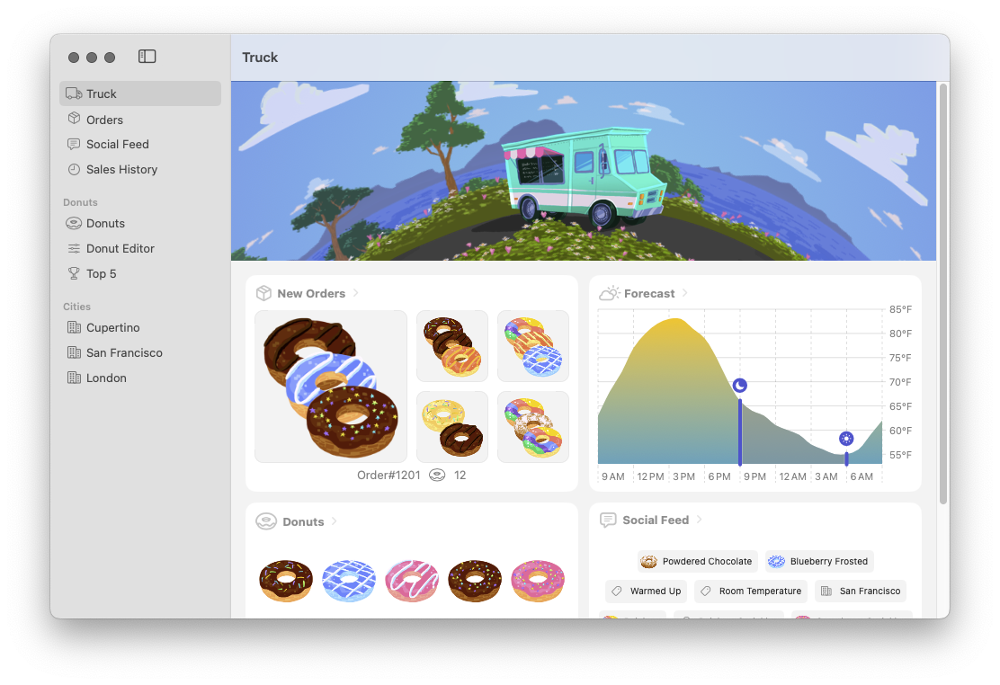
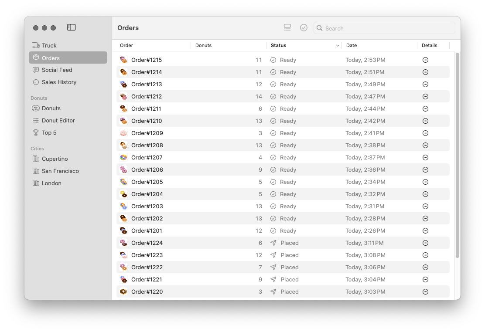

# Swift-CowBox-Sample

`Swift-CowBox`[^1] is a simple set of Swift Macros for adding easy copy-on-write semantics to Swift Structs.

Let’s see the macro in action. Suppose we define a simple Swift Struct:

```swift
public struct Person {
  public let id: String
  public var name: String
}
```

This struct is a `Person` with two stored variables: a non-mutable `id` and a mutable `name`. Let’s see how we can use the `CowBox` macros to give this struct copy-on-write semantics:

```swift
import CowBox

@CowBox public struct Person {
  @CowBoxNonMutating public var id: String
  @CowBoxMutating public var name: String
}
```

Our `CowBoxNonMutating` macro attaches to a stored property to indicate we synthesize a getter (we must transform the `let` to `var` before attaching an accessor). We use `CowBoxMutating` to indicate we synthesize a getter and a setter. Let’s expand this macro to see the code that is generated for us:

```swift
public struct Person {
  public var id: String {
    get {
      self._storage.id
    }
  }
  public var name: String {
    get {
      self._storage.name
    }
    set {
      if Swift.isKnownUniquelyReferenced(&self._storage) == false {
        self._storage = self._storage.copy()
      }
      self._storage.name = newValue
    }
  }
  
  private final class _Storage: @unchecked Sendable {
    let id: String
    var name: String
    init(id: String, name: String) {
      self.id = id
      self.name = name
    }
    func copy() -> _Storage {
      _Storage(id: self.id, name: self.name)
    }
  }
  
  private var _storage: _Storage
  
  public init(id: String, name: String) {
    self._storage = _Storage(id: id, name: name)
  }
}

extension Person: CowBox {
  public func isIdentical(to other: Person) -> Bool {
    self._storage === other._storage
  }
}
```

All of this boilerplate to manage and access the underlying storage object reference is provided by the macro. The macro also provides a memberwise initializer. An `isIdentical` function is provided for quickly confirming two struct values point to the same storage object reference.

The `Swift-CowBox` repo comes with a set of benchmarks for examples of how copy-on-write semantics can reduce CPU and memory usage at scale. Those benchmarks tell us one side of the story: measuring performance independent of any user interface. Many of us are going to be building (and maintaining) complex apps with complex views. How would adopting `Swift-CowBox` affect performance in apps built for SwiftUI?

## Food Truck

Our experiments will begin with `sample-food-truck`[^2] from Apple. This project has two important details that make it a good choice for us to use for benchmarking `Swift-CowBox`: the `sample-food-truck` app is built from SwiftUI, and the underlying data models are built on value types (as opposed to an object-oriented solution like Core Data or SwiftData).

To get started, feel free to clone the original repo and build the app locally. You can try as many platforms as you like, but we will focus on macOS for our analysis. Here is what the app looks like built for macOS:

<picture>
 <source media="(prefers-color-scheme: dark)" srcset="2024-04-26-3.png">
 <source media="(prefers-color-scheme: light)" srcset="2024-04-26-1.png">
 
</picture>

We will spend most of our time investigating the `OrdersTable`. Here is what that component looks like:

<picture>
 <source media="(prefers-color-scheme: dark)" srcset="2024-04-26-4.png">
 <source media="(prefers-color-scheme: light)" srcset="2024-04-26-2.png">
 
</picture>

The `OrdersTable`[^3] is a SwiftUI component that reads (and displays) data from a `FoodTruckModel`[^4] object instance. The `FoodTruckModel` object instance manages an `Array` of `Order`[^5] value types. Our sample app from Apple launches with 24 `Order` instances generated from a `OrderGenerator`[^6]. We will increase this by three orders of magnitude and measure performance as we migrate our `Order` struct to copy-on-write semantics.

Feel free to look around this code and investigate how things are currently architected before moving forward. We will be hacking on the sample project from Apple to collect our measurements. You can choose to follow along by hacking on the Apple repo, or you can clone the `Swift-CowBox-Sample` fork to see the complete project with our changes already implemented.

When choosing whether or not to adopt `CowBox` in a project, start by looking for data structures that would produce a measurable performance benefit from migrating to copy-on-write. Our `Order` value-type is complex (much more data than is needed by one pointer) and is copied many times over an app lifecycle. Instead of migrating several data structures to copy-on-write semantics all at once, let’s start just with `Order` (and measure our performance against our baseline).

## Order Struct

Our goal will be to test the performance of our Food Truck app with (and without) copy-on-write semantics added to the `Order` struct instances that are passed to the `OrdersTable` component. We can begin by inspecting the `Order` type to see what kind of a memory footprint we are starting with for every struct instance. To read this without the overhead of our SwiftUI app, we can build a new executable package.[^7] Here is all we need:[^8]

```swift
let size = MemoryLayout<Order>.size
print("size: \(size)")
// Struct: 137

let stride = MemoryLayout<Order>.stride
print("stride: \(stride)")
// Struct: 144

let alignment = MemoryLayout<Order>.alignment
print("alignment: \(alignment)")
// Struct: 8
```

The `stride` of every `Order` instance measures 144 bytes. For one `Array` of *n* `Order` elements, we can expect to consume at least 144*n* bytes of memory.[^9]

### Benchmarks

Now that we have a basic understanding of the memory footprint of one `Order` instance, we will start the work to define benchmarks against our data models. We start with a hack on `FoodTruckModel`. The `FoodTruckModel` comes with some code to simulate new orders coming in after the app is launched. This can make our measurements a little more noisy than necessary. Let’s disable this functionality before moving forward:

```diff
         monthlyOrderSummaries = Dictionary(uniqueKeysWithValues: City.all.map { city in
             (key: city.id, orderGenerator.historicalMonthlyOrders(since: .now, cityID: city.id))
         })
-        Task(priority: .background) {
-            var generator = OrderGenerator.SeededRandomGenerator(seed: 5)
-            for _ in 0..<20 {
-                try? await Task.sleep(nanoseconds: .secondsToNanoseconds(.random(in: 3 ... 8, using: &generator)))
-                Task { @MainActor in
-                    withAnimation(.spring(response: 0.4, dampingFraction: 1)) {
-                        self.orders.append(orderGenerator.generateOrder(number: orders.count + 1, date: .now, generator: &generator))
-                    }
-                }
-            }
-        }
```

The `FoodTruckModel` uses the `OrderGenerator` type to build its `Array` of `Order` elements. Let’s make these two changes in `OrderGenerator` to measure at a larger scale:

```diff
         let startingDate = Date.now
         var generator = SeededRandomGenerator(seed: 1)
         var previousOrderTime = startingDate.addingTimeInterval(-60 * 4)
-        let totalOrders = 24
+        let totalOrders = 24_000
         return (0 ..< totalOrders).map { index in
             previousOrderTime -= .random(in: 60 ..< 180, using: &generator)
```
```diff
         let totalSales = sales.map(\.value).reduce(0, +)
         return Order(
-            id: String(localized: "Order") + String(localized: ("#\(12)\(number, specifier: "%02d")")),
+            id: "Order#\(number)",
             status: .placed,
             donuts: Array(donuts),
             sales: sales,
```

We can now begin to run some benchmarks against this `FoodTruckModel`. These measurements will act as a set of baselines before we transition our `Order` type to copy-on-write semantics. We start with defining a new executable package[^10] that depends on the `Benchmark`[^11] project from Ordo One. If you’re not experienced with `Benchmark`, feel free to browse through the documentation and samples from Ordo One. Here is what our benchmarks will look like:[^12]:

```swift
@MainActor let benchmarks = {
  Benchmark.defaultConfiguration.metrics = .default
  Benchmark.defaultConfiguration.timeUnits = .microseconds
  Benchmark.defaultConfiguration.maxDuration = .seconds(86400)
  Benchmark.defaultConfiguration.maxIterations = .count(1000)
  
  Benchmark("FoodTruckModel.init") { benchmark in
    benchmark.startMeasurement()
    let model = FoodTruckModel()
    benchmark.stopMeasurement()
    precondition(model.orders.count == 24_000)
    blackHole(model)
  }
  
  Benchmark("FoodTruckModel.sortedOrders") { benchmark in
    let model = FoodTruckModel()
    benchmark.startMeasurement()
    let orders = model.orders.sorted(using: [KeyPathComparator(\Order.status, order: .reverse)])
    benchmark.stopMeasurement()
    precondition(orders.count == 24_000)
    blackHole(model)
    blackHole(orders)
  }
  
  Benchmark("FoodTruckModel.markOrderAsCompleted") { benchmark in
    let model = FoodTruckModel()
    let id = model.orders[23_999].id
    benchmark.startMeasurement()
    model.markOrderAsCompleted(id: id)
    benchmark.stopMeasurement()
    precondition(model.orders[23_999].status == .completed)
    precondition(model.orders.count == 24_000)
    blackHole(model)
  }
  
  Benchmark("FoodTruckModel.orders.equal") { benchmark in
    let model = FoodTruckModel()
    var orders = model.orders
    orders[23_999].status = .completed
    let id = model.orders[23_999].id
    model.markOrderAsCompleted(id: id)
    benchmark.startMeasurement()
    precondition(model.orders == orders)
    benchmark.stopMeasurement()
    precondition(model.orders.count == 24_000)
    blackHole(model)
    blackHole(orders)
  }
}
```

Let’s read through and see what our goal is with these measurements:

* `FoodTruckModel.init`: Our app creates a new `FoodTruckModel` on app launch. We want to measure a baseline to see if any changes introduce measurable impacts to app launch time.[^13]
* `FoodTruckModel.sortedOrders`: Our `OrdersTable` component sorts `Order` instances before displaying. We can expect this operation to be on the order of O(*n* log *n*) complexity.
* `FoodTruckModel.markOrderAsCompleted`: Our `OrdersTable` component displays an array of `Order` instances. The user has the option to mark an arbitrary order as completed. We will make use of this operation when we run our performance tests in Instruments.
* `FoodTruckModel.orders.equal`: Equality is a very common (and important) operation in SwiftUI. We will see later how many times we can expect equality to be checked across one app launch.

We are ready to run these benchmarks:

```
cd FoodTruckKit/Benchmarks
swift package -c release benchmark
```

Here is what our results look like on a MacBook Pro with Apple M2 Max:

| FoodTruckModel.init | Instructions | Memory (resident peak) | Time (total CPU) |
| --- | --- | --- | --- |
| Order Struct | 1046 M  | 64 M  | 75039 μs |

| FoodTruckModel.sortedOrders | Instructions | Memory (resident peak) | Time (total CPU) |
| --- | --- | --- | --- |
| Order Struct | 385 M  | 69 M  | 25543 μs |

| FoodTruckModel.markOrderAsCompleted | Instructions | Memory (resident peak) | Time (total CPU) |
| --- | --- | --- | --- |
| Order Struct | 16 M  | 69 M  | 1802 μs |

| FoodTruckModel.orders.equal | Instructions | Memory (resident peak) | Time (total CPU) |
| --- | --- | --- | --- |
| Order Struct | 72 M  | 68 M  | 5595 μs |

Once we have our `Order` type migrated to copy-on-write semantics, we will come back and compare how these benchmarks have changed. For now, let’s turn our attention to building (and running) our SwiftUI app.

### Equality

We suggested that equality is an important operation for SwiftUI apps. Let’s add a hack to try and measure just how many times we can expect equality to be checked.

When the number of our `Order` elements might be very small, we can measure the amount of times equality is checked by adding a breakpoint:

```
breakpoint set --name "static FoodTruckKit.Order.__derived_struct_equals(FoodTruckKit.Order, FoodTruckKit.Order) -> Swift.Bool"
breakpoint modify --auto-continue true
```

With a small number of `Order` elements, we can confirm the number of times equality is tested. We also can confirm that SwiftUI is performing these equality checks on the main thread. With 24K `Order` elements, this approach (breakpoints) can lead to performance problems. For now, we can try a hack directly on the `Order` implementation to track that ourselves directly:

```diff
 import Foundation
 import SwiftUI
 
-public struct Order: Identifiable, Equatable {
+public struct Order: Identifiable {
+    static var count = 0
+    
     public var id: String
```

```diff
+extension Order: Equatable {
+    public static func == (lhs: Order, rhs: Order) -> Bool {
+        self.count += 1
+        guard lhs.id == rhs.id else {
+            return false
+        }
+        guard lhs.status == rhs.status else {
+            return false
+        }
+        guard lhs.donuts == rhs.donuts else {
+            return false
+        }
+        guard lhs.sales == rhs.sales else {
+            return false
+        }
+        guard lhs.grandTotal == rhs.grandTotal else {
+            return false
+        }
+        guard lhs.city == rhs.city else {
+            return false
+        }
+        guard lhs.parkingSpot == rhs.parkingSpot else {
+            return false
+        }
+        guard lhs.creationDate == rhs.creationDate else {
+            return false
+        }
+        guard lhs.completionDate == rhs.completionDate else {
+            return false
+        }
+        guard lhs.temperature == rhs.temperature else {
+            return false
+        }
+        guard lhs.wasRaining == rhs.wasRaining else {
+            return false
+        }
+        return true
+    }
+}
```

When we build and run our app (with 24K `Order` elements), we can quickly start to see how many equality checks SwiftUI might attempt:

* After app launch, the value of `Order.count` is 2.
* After navigating to the `OrdersTable` component, the value of `Order.count` is 4.
* After selecting one `Order` in the `OrdersTable` component, the value of `Order.count` is 48329.
* After marking the selected `Order` as completed (with the checkmark toolbar button), the value of `Order.count` is 72356.

From our benchmarks, we saw that testing 24K `Order` elements for equality needs about 5.5 ms on average. We performed 72K equality checks just to mark one `Order` as completed. That’s about 16.5 ms we spent testing equality when only one instance (out of 24K) actually changed. Since these checks all happen on the main thread, this is time that could add up and contribute to dropped frames or slow animations.[^15] When we migrate our `Order` type to copy-on-write semantics, we will see how much faster equality is when we know that two `Order` instances are identical copies that have not been mutated.

We don’t need this custom equality implementation for the rest of our measurements, so this can be reverted out for now.

### Instruments

Let’s turn our attention to Instruments and begin to measure the performance of a complete app lifecycle. Before we launch instruments, let’s add some extra code to our app to take some more measurements. We will add `OSSignposter`[^16] here in `FoodTruckModel`:

```diff
 import SwiftUI
 import Combine
+import os
```

```diff
     public init() {
+        let signposter = OSSignposter()
+        let state = signposter.beginInterval("FoodTruckModel.init")
+        defer {
+            signposter.endInterval("FoodTruckModel.init", state)
+        }
         newDonut = Donut(
             id: Donut.all.count,
             name: String(localized: "New Donut", comment: "New donut-placeholder name."),
```
```diff
     public func markOrderAsCompleted(id: Order.ID) {
+        let signposter = OSSignposter()
+        let state = signposter.beginInterval("FoodTruckModel.markOrderAsCompleted")
+        defer {
+            signposter.endInterval("FoodTruckModel.markOrderAsCompleted", state)
+        }
         guard let index = orders.firstIndex(where: { $0.id == id }) else {
             return
         }
```

We will add `OSSignposter` here in `OrdersTable`:

```diff
 import SwiftUI
 import FoodTruckKit
+import os
```

```diff
     @Binding var searchText: String
     
     var orders: [Order] {
-        model.orders.filter { order in
+        let signposter = OSSignposter()
+        let state = signposter.beginInterval("FoodTruckModel.sortedOrders")
+        defer {
+            signposter.endInterval("FoodTruckModel.sortedOrders", state)
+        }
+        return model.orders.filter { order in
             order.matches(searchText: searchText) || order.donuts.contains(where: { $0.matches(searchText: searchText) })
         }
         .sorted(using: sortOrder)
     }
```

We now have three `OSSignposter` intervals to measure work we measured in the original benchmarks we ran from the command-line. Let’s build and run (and launch in Instruments) so we can see how these measurements look (we launch Instruments and select the os_signposts instrument). Here is the pattern we will use when we launch:

* Launch App.
* Navigate to `OrdersTable`.
* Select the top `Order`.
* Mark the first `Order` as completed.
* Select the second `Order`.
* Mark the second `Order` as completed.
* Continue selecting the top ten `Order` instances and marking each as completed (one at a time).

Here is what our measurements look like:

| FoodTruckModel.init | Count | Total Duration
| --- | --- | --- |
| Order Struct | 1 | 81.23 ms

| FoodTruckModel.sortedOrders | Avg Duration | Std Dev Duration | Count | Total Duration
| --- | --- | --- | --- | --- |
| Order Struct | 63.57 ms | 4.52 ms | 21 | 1.33 s

| FoodTruckModel.markOrderAsCompleted | Avg Duration | Std Dev Duration | Count | Total Duration
| --- | --- | --- | --- | --- |
| Order Struct | 10.63 ms | 1.03 ms | 10 | 106.28 ms

What jumps out at us about these results? We are sorting our `Order` instances 21 times. We can understand why we sort once (the first time) when the `OrdersTable` is displayed. We can understand why we sort ten times (once after every `Order` instance is mutated). What about the remaining ten times?

When we investigate the implementation of `OrdersTable`, we can see what might be leading to this extra work.

```swift
@Binding var selection: Set<Order.ID>

var body: some View {
    Table(selection: $selection, sortOrder: $sortOrder) {
        TableColumn...
```

The `selection` binding is mutated by the `Table` component when we select every row. This is leading to another `body` being computed. Here is the component that is computed from `OrdersTable`:

```swift
var orders: [Order] {
    model.orders.filter { order in
        order.matches(searchText: searchText) || order.donuts.contains(where: { $0.matches(searchText: searchText) })
    }
    .sorted(using: sortOrder)
}

var body: some View {
    Table(selection: $selection, sortOrder: $sortOrder) {
        TableColumn...
        TableColumn...
        TableColumn...
        TableColumn...
        TableColumn...
    } rows: {
        Section {
            ForEach(orders) { order in
                TableRow(order)
            }
        }
    }
}
```

We’re not (currently) doing anything to cache these sorted `Order` instances. These are O(*n* log *n*) operations that add up to a lot of extra time spent on the main thread. This is not directly related to a discussion about copy-on-write semantics, but we will look at a strategy later to optimize this.

Now that we have a baseline measurement for those signposts, let’s build some more baseline measurements for app performance. Let’s launch Instruments again. This time we select the SwiftUI template[^17]. Before we launch our app and begin recording, we also add the Allocations instrument[^18] to measure our memory footprint. We also update the Hangs instrument to measure for hangs greater than 33 ms (the default setting measures for hangs greater than 100 ms).

We launch our app in Instruments and complete the same steps as before (navigation to `OrdersTable` and mark the first ten `Order` instances as completed). Here are some highlights from our measurements:

| Core Animation Commits | Avg Duration | Count | Total Duration
| --- | --- | --- | --- |
| Order Struct | 20.03 ms | 811 | 16.25 s

| Hangs | Avg Duration | Count | Total Duration
| --- | --- | --- | --- |
| Order Struct | 698.27 ms | 63 | 43.99101 s

| Allocations | Persistent Bytes | Total Bytes
| --- | --- | --- |
| Order Struct | 189.19 M | 4.59 G

Now that we have some baselines for the performance of our app when `Order` is a conventional struct, let’s see how migrating `Order` to copy-on-write semantics affects our measurements.

## Order CowBox

Let’s start by importing the `Swift-CowBox` repo into the `FoodTruckKit` package description:

```diff
-// swift-tools-version: 5.7
+// swift-tools-version: 5.9.2
```

```diff
             targets: ["FoodTruckKit"]
         )
     ],
-    dependencies: [],
+    dependencies: [
+        .package(
+            url: "https://github.com/swift-cowbox/swift-cowbox.git",
+            branch: "main"
+        ),
+    ],
     targets: [
         .target(
             name: "FoodTruckKit",
-            dependencies: [],
+            dependencies: [
+                .product(
+                    name: "CowBox",
+                    package: "swift-cowbox"
+                ),
+            ],
             path: "Sources"
         )
     ]
```

Next, we update the `Order` struct:

```diff
 import Foundation
 import SwiftUI
+import CowBox
 
-public struct Order: Identifiable, Equatable {
-    public var id: String
+@CowBox public struct Order: Identifiable, Equatable {
+    @CowBoxMutating public var id: String
     
     // order
-    public var status: OrderStatus
-    public var donuts: [Donut]
-    public var sales: [Donut.ID: Int]
-    public var grandTotal: Decimal
+    @CowBoxMutating public var status: OrderStatus
+    @CowBoxMutating public var donuts: [Donut]
+    @CowBoxMutating public var sales: [Donut.ID: Int]
+    @CowBoxMutating public var grandTotal: Decimal
     
     // location
-    public var city: City.ID
-    public var parkingSpot: ParkingSpot.ID
+    @CowBoxMutating public var city: City.ID
+    @CowBoxMutating public var parkingSpot: ParkingSpot.ID
     
     // metadata
-    public var creationDate: Date
-    public var completionDate: Date?
-    public var temperature: Measurement<UnitTemperature>
-    public var wasRaining: Bool
-    
-    public init(
-        id: String,
-        status: OrderStatus,
-        donuts: [Donut],
-        sales: [Donut.ID: Int],
-        grandTotal: Decimal,
-        city: City.ID,
-        parkingSpot: ParkingSpot.ID,
-        creationDate: Date,
-        completionDate: Date?,
-        temperature: Measurement<UnitTemperature>,
-        wasRaining: Bool
-    ) {
-        self.id = id
-        self.status = status
-        self.donuts = donuts
-        self.sales = sales
-        self.grandTotal = grandTotal
-        self.city = city
-        self.parkingSpot = parkingSpot
-        self.creationDate = creationDate
-        self.completionDate = completionDate
-        self.temperature = temperature
-        self.wasRaining = wasRaining
-    }
+    @CowBoxMutating public var creationDate: Date
+    @CowBoxMutating public var completionDate: Date?
+    @CowBoxMutating public var temperature: Measurement<UnitTemperature>
+    @CowBoxMutating public var wasRaining: Bool
     
     public var duration: TimeInterval? {
         guard let completionDate = completionDate else {
```

Let’s go back to the `Client` executable we wrote for quickly testing the memory footprint of every `Order` instance (and we compare that footprint to our previous results):

```
let size = MemoryLayout<Order>.size
print("size: \(size)")
// Struct: 137
// CowBox: 8

let stride = MemoryLayout<Order>.stride
print("stride: \(stride)")
// Struct: 144
// CowBox: 8

let alignment = MemoryLayout<Order>.alignment
print("alignment: \(alignment)")
// Struct: 8
// CowBox: 8
```

As expected, the memory footprint of one `Order` instance (that implements copy-on-write) is just the width of one pointer. We will still need to allocate (at least) 144 more bytes of memory for the storage object instance, but two `Order` instances that are identical (they share the same storage object instance) will now use a lot less memory with copy-on-write semantics in-place.

### Benchmarks

Let’s go back to the benchmarks we ran from the command-line. Let’s see how these `CowBox` structs perform compared to our earlier measurements:

```
cd FoodTruckKit/Benchmarks
swift package -c release benchmark
```

Here are the results (along with the previous results):

| FoodTruckModel.init | Instructions | Memory (resident peak) | Time (total CPU) |
| --- | --- | --- | --- |
| Order Struct | 1046 M  | 64 M  | 75039 μs |
| Order CowBox | 1072 M  | 77 M  | 79233 μs |

| FoodTruckModel.sortedOrders | Instructions | Memory (resident peak) | Time (total CPU) |
| --- | --- | --- | --- |
| Order Struct | 385 M  | 69 M  | 25543 μs |
| Order CowBox | 665 M  | 84 M  | 31654 μs |

| FoodTruckModel.markOrderAsCompleted | Instructions | Memory (resident peak) | Time (total CPU) |
| --- | --- | --- | --- |
| Order Struct | 16 M  | 69 M  | 1802 μs |
| Order CowBox | 2679 K  | 85 M  | 311 μs |

| FoodTruckModel.orders.equal | Instructions | Memory (resident peak) | Time (total CPU) |
| --- | --- | --- | --- |
| Order Struct | 72 M  | 68 M  | 5595 μs |
| Order CowBox | 9183 K  | 85 M  | 708 μs |

Across the board, it looks like modeling our `Order` with copy-on-write consumes more memory. This is expected. We see mixed results when it comes to CPU performance. Creating our `FoodTruckModel` is slightly slower with `CowBox`, sorting our `Order` instances is slower with `CowBox`, marking one order as completed is much faster with `CowBox`, and testing two unique `Array` instances for equality when the elements are (almost all) identical is much faster with `CowBox`.

### Equality

We saw that testing two `Order` instances for equality is much faster when we know that we can test for equality by identity with `CowBox`. Let’s try a quick hack to confirm how many times equality is being checked by SwiftUI. This will be a similar pattern to our previous experiment.

We do have the option to set a breakpoint on equality:

```
breakpoint set --name "static FoodTruckKit.Order.== infix(FoodTruckKit.Order, FoodTruckKit.Order) -> Swift.Bool"
breakpoint modify --auto-continue true
```

This would probably lead to performance problems for the amount of times we expect this breakpoint to hit. Let’s try the same approach we tried earlier. We start with a hack on `Order`:

```diff
 import SwiftUI
 import CowBox
 
-@CowBox public struct Order: Identifiable, Equatable {
+@CowBox public struct Order: Identifiable {
+    static var count = 0
+    
     @CowBoxMutating public var id: String
```

```diff
+extension Order: Equatable {
+    public static func == (lhs: Order, rhs: Order) -> Bool {
+        self.count += 1
+        if lhs.isIdentical(to: rhs) {
+            return true
+        }
+        guard lhs.id == rhs.id else {
+            return false
+        }
+        guard lhs.status == rhs.status else {
+            return false
+        }
+        guard lhs.donuts == rhs.donuts else {
+            return false
+        }
+        guard lhs.sales == rhs.sales else {
+            return false
+        }
+        guard lhs.grandTotal == rhs.grandTotal else {
+            return false
+        }
+        guard lhs.city == rhs.city else {
+            return false
+        }
+        guard lhs.parkingSpot == rhs.parkingSpot else {
+            return false
+        }
+        guard lhs.creationDate == rhs.creationDate else {
+            return false
+        }
+        guard lhs.completionDate == rhs.completionDate else {
+            return false
+        }
+        guard lhs.temperature == rhs.temperature else {
+            return false
+        }
+        guard lhs.wasRaining == rhs.wasRaining else {
+            return false
+        }
+        return true
+    }
+}
```

When we build and run our app (and follow the same steps as before), here are the results:

* After app launch, the value of `Order.count` is 2.
* After navigating to the `OrdersTable` component, the value of `Order.count` is 4.
* After selecting one `Order` in the `OrdersTable` component, the value of `Order.count` is 48329.
* After marking the selected `Order` as completed (with the checkmark toolbar button), the value of `Order.count` is 72356.

These numbers are identical to what we saw before we migrated `Order` to copy-on-write semantics. We are still making many checks for equality, but we now expect those checks to take much less time because of `CowBox`.

We don’t need this custom equality implementation for the rest of our measurements, so this can be reverted out for now.

### Instruments

We still have our signpost intervals defined from our previous measurements. Let’s run Instruments (with the os_signposts instrument). We follow the same steps as before (we navigate to `OrdersTable` and mark the first ten `Order` instances as completed). Let’s see how these signpost intervals measure compared with the previous measurements:

| FoodTruckModel.init | Count | Total Duration
| --- | --- | --- |
| Order Struct | 1 | 81.23 ms
| Order CowBox | 1 | 85.11 ms

| FoodTruckModel.sortedOrders | Avg Duration | Std Dev Duration | Count | Total Duration
| --- | --- | --- | --- | --- |
| Order Struct | 63.57 ms | 4.52 ms | 21 | 1.33 s
| Order CowBox | 71.15 ms | 1.32 ms | 21 | 1.49415 s

| FoodTruckModel.markOrderAsCompleted | Avg Duration | Std Dev Duration | Count | Total Duration
| --- | --- | --- | --- | --- |
| Order Struct | 10.63 ms | 1.03 ms | 10 | 106.28 ms
| Order CowBox | 3.07 ms | 195.01 µs | 10 | 30.73 ms

These numbers look consistent with the Benchmarks we ran from command-line. Let’s try to run additional instruments like we did before. We launch Instruments with the SwiftUI template and add the Allocations instrument. We also update the Hangs instrument to measure for hangs greater than 33 ms. Here are the results (along with the previous results) when we run through all the steps:

| Core Animation Commits | Avg Duration | Count | Total Duration
| --- | --- | --- | --- |
| Order Struct | 20.03 ms | 811 | 16.25 s
| Order CowBox | 12.21 ms | 907 | 11.07447 s

| Hangs | Avg Duration | Count | Total Duration
| --- | --- | --- | --- |
| Order Struct | 698.27 ms | 63 | 43.99101 s
| Order CowBox | 576.15 ms | 62 | 35.7213 s

| Allocations | Persistent Bytes | Total Bytes
| --- | --- | --- |
| Order Struct | 189.19 M | 4.59 G
| Order CowBox | 172.82 M | 2.83 G

These look very interesting. Let’s take a closer look:

* Core Animation
  * Migrating to `CowBox` reduced Core Animation commits by about 32 percent over the lifetime of our app.
* Hangs
  * Migrating to `CowBox` reduced main thread hangs by about 19 percent over the lifetime of our app.
* Allocations
  * Migrating to `CowBox` reduced our memory footprint (Persistent Bytes) by about 9 percent.
  * The total memory consumption (including memory that was consumed and disposed) was reduced by about 39 percent over the lifetime of our app.

These all look very impactful. What is also very interesting is that we saw these big performance improvements without refactoring our UI components. All we did here was change an implementation detail about one type in our data model layer. Our UI components don’t need to know (or care) what that change was, but the performance improvements are real and measurable.

## Order CowBox and Memoization

We saw a lot of improvements to performance just from changing the implementation of our data model layer. The *interface* of our data model layer remained the same. We also did not attempt to optimize the implementation of our view component layer. This project is intended to demonstrate the benefits of copy-on-write semantics in our data model layer, but we can begin to attempt a refactoring in our view component layer to see how the optimizations we measured by migrating to copy-on-write semantics in our data model layer are affected.

Let’s take another look at our `OrdersTable` component. As we discovered, our `OrdersTable` is not caching (or saving) its underlying set of `Order` elements in the order they are presented on-screen. When the state of our component changes (like when the user selects an element), this is leading to another O(*n* log *n*) operation to sort all our `Order` elements again (even if those `Order` elements have not changed). This is a lot of extra work that is all happening on the main thread. Moving that sorting to a background thread could help, but we would like to find a way to prevent unnecessary sorting operations from happening in the first place.

Here is the computed property our `OrdersTable` uses to sort `Order` elements:

```swift
var orders: [Order] {
    model.orders.filter { order in
        order.matches(searchText: searchText) || order.donuts.contains(where: { $0.matches(searchText: searchText) })
    }
    .sorted(using: sortOrder)
}
```

This is an instance property on our component, but suppose we thought of this as a stateless function. Here is an example of what that might look like:

```swift
func SortedOrders(
    orders: [Order],
    searchText: String,
    sortOrder: [KeyPathComparator<Order>]
) -> [Order] {
    orders.filter { order in
        order.matches(searchText: searchText) || order.donuts.contains(where: { $0.matches(searchText: searchText) })
    }
    .sorted(using: sortOrder)
}
```

Our stateless function takes three parameters as input and returns a sorted array as an output. Because there is no state, no side-effects, and no nondeterministic behavior in this algorithm, there should be no reason that one set of input values ever produces two different sets of output values.

If you are familiar with the React JS (and Redux) ecosystems, you might have encountered “memoized” selectors.[^19] We will use a similar idea here for optimizing our sorting operations. We will draw inspiration from the `extendedswift`[^20] repo from Dave DeLong and build a property wrapper using `DynamicProperty` to memoize our sorted array:

```swift
@propertyWrapper struct SortedOrders: DynamicProperty {
    @State var sortOrder = [KeyPathComparator(\Order.status, order: .reverse)]
    
    @State private var storage: Storage
    
    private var orders: [Order]
    private var searchText: String
    
    init(
        orders: [Order],
        searchText: String
    ) {
        self.storage = Storage(
            orders: orders,
            searchText: searchText
        )
        self.orders = orders
        self.searchText = searchText
    }
    
    var wrappedValue: [Order] {
        guard
            let output = self.storage.output
        else {
            fatalError("missing output")
        }
        return output
    }
    
    mutating func update() {
        self.storage.update(
            orders: self.orders,
            searchText: self.searchText,
            sortOrder: self.sortOrder
        )
    }
}

extension SortedOrders {
    final class Storage {
        private var orders: [Order]
        private var searchText: String
        private var sortOrder: [KeyPathComparator<Order>] = []
        
        var output: [Order]?
        
        init(
            orders: [Order],
            searchText: String
        ) {
            self.orders = orders
            self.searchText = searchText
        }
        
        func update(
            orders: [Order],
            searchText: String,
            sortOrder: [KeyPathComparator<Order>]
        ) {
            if self.output != nil,
               orders == self.orders,
               searchText == self.searchText,
               sortOrder == self.sortOrder {
                self.orders = orders
                self.searchText = searchText
                self.sortOrder = sortOrder
            } else {
                self.orders = orders
                self.searchText = searchText
                self.sortOrder = sortOrder
                self.update()
            }
        }
        
        private func update() {
            let signposter = OSSignposter()
            let state = signposter.beginInterval("FoodTruckModel.sortedOrders")
            defer {
                signposter.endInterval("FoodTruckModel.sortedOrders", state)
            }
            self.output = self.orders.filter { order in
                order.matches(searchText: self.searchText) || order.donuts.contains(where: { $0.matches(searchText: self.searchText) })
            }
            .sorted(using: self.sortOrder)
        }
    }
}
```

Before our component `body` is computed, our `SortedOrders` property wrapper will use `update` to pass its latest state through to its `storage` property. If the input values have changed from the last time the output was computed, a new output is computed.

Here is the new implementation of `OrdersTable` to use the `SortedOrders` wrapper:

```diff
 struct OrdersTable: View {
     @ObservedObject var model: FoodTruckModel
-    @State private var sortOrder = [KeyPathComparator(\Order.status, order: .reverse)]
     @Binding var selection: Set<Order.ID>
     @Binding var completedOrder: Order?
     @Binding var searchText: String
     
-    var orders: [Order] {
-        model.orders.filter { order in
-            order.matches(searchText: searchText) || order.donuts.contains(where: { $0.matches(searchText: searchText) })
-        }
-        .sorted(using: sortOrder)
+    @SortedOrders private var orders: [Order]
+    
+    init(model: FoodTruckModel, selection: Binding<Set<Order.ID>>, completedOrder: Binding<Order?>, searchText: Binding<String>) {
+        self.model = model
+        self._selection = selection
+        self._completedOrder = completedOrder
+        self._searchText = searchText
+        self._orders = SortedOrders(orders: model.orders, searchText: searchText.wrappedValue)
     }
     
     var body: some View {
-        Table(selection: $selection, sortOrder: $sortOrder) {
+        Table(selection: $selection, sortOrder: _orders.$sortOrder) {
             TableColumn("Order", value: \.id) { order in
                 OrderRow(order: order)
                     .frame(maxWidth: .infinity, alignment: .leading)
```

We can build and run our app, navigate to `OrdersTable`, and sort and select `Order` instances just like before. It looks like we didn’t break anything, but what happens when we measure the performance of this refactoring?

### Equality

Let’s start by finding out how many times SwiftUI is testing our `Order` instances for equality. We can use the same hack from before and follow those same steps. Here is what the numbers look like:

* After app launch, the value of `Order.count` is 2.
* After navigating to the `OrdersTable` component, the value of `Order.count` is 4.
* After selecting one `Order` in the `OrdersTable` component, the value of `Order.count` is 329.
* After marking the selected `Order` as completed (with the checkmark toolbar button), the value of `Order.count` is 24366.

Navigating to `OrdersTable` and marking one `Order` instance as completed needed 72K equality operations in our previous implementation. We reduced that work down to 24K now that we memoize our sorted array.

### Instruments

Let’s take another look at Instruments. We follow our previous pattern. We run Instruments (with the os_signposts instrument). We follow the same steps as before (we navigate to `OrdersTable` and mark the first ten `Order` instances as completed). Here are the measurements:

| FoodTruckModel.init | Count | Total Duration
| --- | --- | --- |
| Order Struct | 1 | 81.23 ms
| Order CowBox | 1 | 85.11 ms
| Memoized Order CowBox | 1 | 84.13 ms

| FoodTruckModel.sortedOrders | Avg Duration | Std Dev Duration | Count | Total Duration
| --- | --- | --- | --- | --- |
| Order Struct | 63.57 ms | 4.52 ms | 21 | 1.33 s
| Order CowBox | 71.15 ms | 1.32 ms | 21 | 1.49415 s
| Memoized Order CowBox | 71.46 ms | 1.10 ms | 11 | 786.03 ms

| FoodTruckModel.markOrderAsCompleted | Avg Duration | Std Dev Duration | Count | Total Duration
| --- | --- | --- | --- | --- |
| Order Struct | 10.63 ms | 1.03 ms | 10 | 106.28 ms
| Order CowBox | 3.07 ms | 195.01 µs | 10 | 30.73 ms
| Memoized Order CowBox | 2.34 ms | 184.12 µs | 10 | 23.37 ms

As expected, we cut our time spent sorting orders in half. Let’s run the next set of Instruments (SwiftUI and allocations) to see more performance measurements:

| Core Animation Commits | Avg Duration | Count | Total Duration
| --- | --- | --- | --- |
| Order Struct | 20.03 ms | 811 | 16.25 s
| Order CowBox | 12.21 ms | 907 | 11.07447 s
| Memoized Order CowBox | 6.66 ms | 1174 | 7.81884 s

| Hangs | Avg Duration | Count | Total Duration
| --- | --- | --- | --- |
| Order Struct | 698.27 ms | 63 | 43.99101 s
| Order CowBox | 576.15 ms | 62 | 35.7213 s
| Memoized Order CowBox | 443.49 ms | 63 | 27.93987 s

| Allocations | Persistent Bytes | Total Bytes
| --- | --- | --- |
| Order Struct | 189.19 M | 4.59 G
| Order CowBox | 172.82 M | 2.83 G
| Memoized Order CowBox | 168.96 M | 2.57 G

Compared to our measurements from our non-memoized solution (with copy-on-write semantics added), we see more improvements to performance:

* Core Animation
  * Migrating to memoized sorting reduced Core Animation commits by about 30 percent over the lifetime of our app.
* Hangs
  * Migrating to memoized sorting reduced main thread hangs by about 22 percent over the lifetime of our app.
* Allocations
  * Migrating to `CowBox` reduced our memory footprint (Persistent Bytes) by about 2 percent.
  * The total memory consumption (including memory that was consumed and disposed) was reduced by about 9 percent over the lifetime of our app.

## Order Struct and Memoization

Before we wrap things up, let’s migrate our `Order` type away from copy-on-write semantics (back to where we started) and keep the memoized sorting operation in `OrdersTable`.

Once we revert our changes to `Order`, we can run the `Client` executable and confirm the memory footprint is back to 144 bytes.

### Equality

Adding back our old hack to test for equality checks, we can count how many times SwiftUI is checking equality. The results should all look identical (or nearly identical) to what we saw in our previous section (when `Order` was still implementing copy-on-write semantics and we memoized sorting).

### Instruments

Let’s open Instruments and begin our measurements with the os_signposts instrument:

| FoodTruckModel.init | Count | Total Duration
| --- | --- | --- |
| Order Struct | 1 | 81.23 ms
| Order CowBox | 1 | 85.11 ms
| Memoized Order CowBox | 1 | 84.13 ms
| Memoized Order Struct | 1 | 81.48 ms

| FoodTruckModel.sortedOrders | Avg Duration | Std Dev Duration | Count | Total Duration
| --- | --- | --- | --- | --- |
| Order Struct | 63.57 ms | 4.52 ms | 21 | 1.33 s
| Order CowBox | 71.15 ms | 1.32 ms | 21 | 1.49415 s
| Memoized Order CowBox | 71.46 ms | 1.10 ms | 11 | 786.03 ms
| Memoized Order Struct | 62.39 ms | 3.30 ms | 11 | 686.32 ms

| FoodTruckModel.markOrderAsCompleted | Avg Duration | Std Dev Duration | Count | Total Duration
| --- | --- | --- | --- | --- |
| Order Struct | 10.63 ms | 1.03 ms | 10 | 106.28 ms
| Order CowBox | 3.07 ms | 195.01 µs | 10 | 30.73 ms
| Memoized Order CowBox | 2.34 ms | 184.12 µs | 10 | 23.37 ms
| Memoized Order Struct | 7.10 ms | 1.10 ms | 10 | 71.01 ms

Let’s finish with the SwiftUI and allocations instruments:

| Core Animation Commits | Avg Duration | Count | Total Duration
| --- | --- | --- | --- |
| Order Struct | 20.03 ms | 811 | 16.25 s
| Order CowBox | 12.21 ms | 907 | 11.07447 s
| Memoized Order CowBox | 6.66 ms | 1174 | 7.81884 s
| Memoized Order Struct | 19.45 ms | 754 | 14.67 s

| Hangs | Avg Duration | Count | Total Duration
| --- | --- | --- | --- |
| Order Struct | 698.27 ms | 63 | 43.99101 s
| Order CowBox | 576.15 ms | 62 | 35.7213 s
| Memoized Order CowBox | 443.49 ms | 63 | 27.93987 s
| Memoized Order Struct | 590.60 ms | 63 | 37.2078 s

| Allocations | Persistent Bytes | Total Bytes
| --- | --- | --- |
| Order Struct | 189.19 M | 4.59 G
| Order CowBox | 172.82 M | 2.83 G
| Memoized Order CowBox | 168.96 M | 2.57 G
| Memoized Order Struct | 185.57 M | 3.96 G

While it looks like memoized sorting does lead to better performance (with and without copy-on-write semantics), we still see the best performance from pairing memoized sorting with copy-on-write semantics.

## Data

Please reference the `Swift-CowBox-Sample-Data`[^21] repo to see the complete benchmark results (including traces from Instruments) that were collected. All measurements were taken from a MacBook Pro with Apple M2 Max and 96 GB of memory running macOS 14.4.1 and Xcode 15.3.

## Conclusions

We began with a sample app from Apple built on immutable value-types. We defined a set of benchmarks that could be measured from the command-line. We also ran our app in Instruments to measure performance over the app lifecycle.

Once we measured our baseline measurements, we migrated one immutable value-type to copy-on-write semantics with the `CowBox` macro. We measured performance improvements: our app ran faster and used less memory.

We refactored our view component to memoize a sorted array. We confirmed that this improved performance. Pairing this refactoring in our view component layer with the refactoring in our data layer gave us the best results.

## Next Steps

The `Swift-CowBox` macro makes it easy to add copy-on-write semantics to structs. We saw how this migration can improve performance in the Food Truck sample app from Apple. Should you migrate your own structs to `Swift-CowBox`? It depends.

The most impactful structs to migrate to copy-on-write semantics would be structs that are complex (a lot of data) that you expect to copy many times over the course of an app lifecycle.

Before you attempt to add `Swift-CowBox`, start with baseline benchmark measurements:

* Control:
  * Confirm the memory footprint of one struct instance.
  * Define (and run) some benchmarks against the data models of your app from a command-line utility like `Benchmark` from Ordo One.
  * Run Instruments like os_signpost, Hangs, Core Animation Commits, and Allocations over an app lifecycle.
* Test:
  * Migrate one data model to copy-on-write semantics with `Swift-CowBox`.
  * Repeat the steps from Control and compare these measurements with your baseline.

Your “control” group would be your app built from your original struct data model. Your “test” group would be your app built with your new `Swift-CowBox` data model.

Use your best judgement. If migrating to `Swift-CowBox` significantly increases app launch time, the performance improvements over the course of your app lifecycle might not be worth it. Someone else can’t make that decision for you; you will have the most context and insight when it comes to what should produce the best user experience for your own customers.

Please file a GitHub issue for any new issues or limitations you encounter when using `Swift-CowBox`.

Thanks!

## Copyright

```
Copyright 2024 North Bronson Software

Licensed under the Apache License, Version 2.0 (the "License");
you may not use this file except in compliance with the License.
You may obtain a copy of the License at

    http://www.apache.org/licenses/LICENSE-2.0

Unless required by applicable law or agreed to in writing, software
distributed under the License is distributed on an "AS IS" BASIS,
WITHOUT WARRANTIES OR CONDITIONS OF ANY KIND, either express or implied.
See the License for the specific language governing permissions and
limitations under the License.
```

[^1]: https://github.com/Swift-CowBox/Swift-CowBox
[^2]: https://github.com/apple/sample-food-truck
[^3]: https://github.com/apple/sample-food-truck/blob/main/App/Orders/OrdersTable.swift
[^4]: https://github.com/apple/sample-food-truck/blob/main/FoodTruckKit/Sources/Model/FoodTruckModel.swift
[^5]: https://github.com/apple/sample-food-truck/blob/main/FoodTruckKit/Sources/Order/Order.swift
[^6]: https://github.com/apple/sample-food-truck/blob/main/FoodTruckKit/Sources/Order/OrderGenerator.swift
[^7]: ../FoodTruckKit/Client/Package.swift
[^8]: ../FoodTruckKit/Client/Sources/main.swift
[^9]: https://github.com/apple/swift/blob/swift-5.10-RELEASE/stdlib/public/core/MemoryLayout.swift#L57-L63
[^10]: ../FoodTruckKit/Benchmarks/Package.swift
[^11]: https://github.com/ordo-one/package-benchmark
[^12]: FoodTruckKit/Benchmarks/Sources/Benchmarks.swift
[^13]: https://developer.apple.com/documentation/xcode/reducing-your-app-s-launch-time
[^14]: https://www.mikeash.com/pyblog/friday-qa-2015-04-17-lets-build-swiftarray.html
[^15]: https://developer.apple.com/documentation/xcode/understanding-user-interface-responsiveness
[^16]: https://developer.apple.com/documentation/os/logging/recording_performance_data
[^17]: https://developer.apple.com/videos/play/wwdc2023/10248/
[^18]: https://developer.apple.com/documentation/xcode/gathering-information-about-memory-use#Profile-your-app-using-the-Allocations-instrument
[^19]: https://redux.js.org/usage/deriving-data-selectors#optimizing-selectors-with-memoization
[^20]: https://github.com/davedelong/extendedswift/blob/main/Sources/ExtendedKit/CoreData/Fetch.swift
[^21]: https://github.com/Swift-CowBox/Swift-CowBox-Sample-Data
